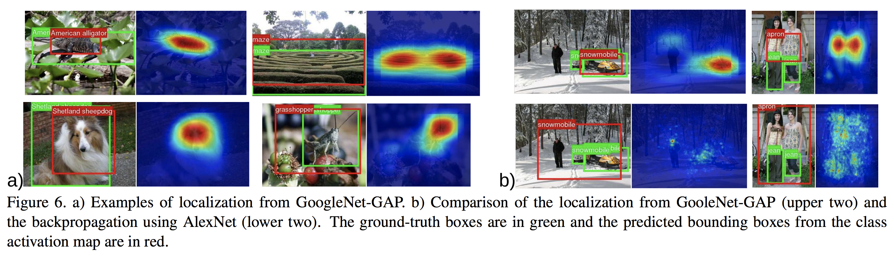

# [Learning Deep Features for Discriminative Localization](https://arxiv.org/abs/1512.04150)

## Abstract
이 논문은 [Network in Network](https://arxiv.org/pdf/1312.4400.pdf)에서 소개된 Global Average Pooling(이하 GAP)을 재조명하고, 이것이 어떻게 CNN으로 하여금 image-level labels만을 가지고도 훌륭한 localization ability를 갖출 수 있도록 했는지 다룬다.
NIN 논문에서의 GAP는 regularize의 방도로 제안되었지만, 이 논문의 저자들은 GAP가 여러 다른 task들에 사용될 수 있는 *generic localizable deep representation*을 만드는 데에도 기여한다는 것을 밝힌다.
앞으로도 계속 강조되지만, 이 저자들은 자신들이 제안하는 Network가 localization을 위해 학습된 것이 아님에도 불구하고, discriminative image region(discriminative라는 단어는 아마도 image를 discimination할 때, 가장 큰 영향을 주는 부분이라는 것에서 비롯된 듯 함)을 localize하는 능력이 있음을 보여준다.

## 1. Introduction
[Object Detectors Emerge in Deep Scene CNNs](https://arxiv.org/abs/1412.6856)에서 CNN의 convolutional unit들이 location에 대한 정보없이도 object detector로써의 역할을 하고 있음을 보였다. 하지만 이런 정보들은 FC를 통과하면서 유실되게 된다.
다른 한편 NIN과 GoogLeNet의 저자들은 FC를 사용하지 않으므로써 parameter의 수를 줄이는 방법을 제안하였다.
이때, NIN의 저자들은 GAP라는 것을 제안하는데, 기존의 FC layer가 해석하기 어려우며, 동시에 쉽게 Overfitting되는 문제를 해소하기 위해서였다.(즉, regularizer를 위해 도입)

한편 이 논문의 저자들은 이 GAP의 약간의 변형을 가하는 것만으로 final layer까지 앞서 말한 Network의 localization정보를 유지할 수 있음을 알게 되었다. 즉, 아래의 Fig. 1과 같이 classification을 위해 학습된 Network가 classification에 중요한(예를 들면, 양치질의 칫솔) 부분을 localization하고 있음을 알 수 있다.

## 1.1 Related Work
이 논문은 크게 2가지 주제의 논문으로부터 영향을 받았다.

1. Weakly-supervised object localization.
2. Visualizing the internal representation of CNNs.

### Weakly-supervised object localization
이전까지 다양한 제안들이 있었으나, 이러한 논문들에서 저자들은 실제로 localization 능력을 측정한 경우는 없었고, 또한 좋은 결과를 산출했음에도 불구하고 end-to-end로 학습한 모델들이 아니었으며, multiple forward pass를 필요로 하여 real-world datasets에 적용하기 어려웠다.
이 논문의 저자들은 end-to-end로 학습가능하고 single forward pass만을 필요로 하는 모델을 제안한다.

이 논문과 가장 밀접한 연관을 지닌 논문은 [Is object localization for free? - Weakly-supervised learning with convolutional neural network, Oquab *et al*](https://ieeexplore.ieee.org/document/7298668/)이다.
Oquab *et al*은 GAP대신 Global Max Pooling을 사용하였는데, 이 논문의 localization은 해당 object의 boundary 안에 있는 point들을 짚어낼 순 있으나 full extent를 알아낼 수는 없다.
이는 GAP의 loss는 모든 discriminative region을 고려해야 benefits을 얻을 수 있기 때문으로 보인다.

이 논문의 저자들은 이 논문의 가치가 GAP가 accurate discriminative localization에 사용될 수 있음을 보이는 것에 있다고 강조한다.

### Visualizing CNNs
지금까지 CNN의 속성을 더 잘 알기 위해 internal representation을 visualize하려는 시도가 꾸준히 있어왔다.
예를 들어, deconvolution을 이용해 각 unit이 input image의 어느 부위를 보고 있는지 시각화하거나 배경을 detect하기 위해 학습된 Network가 object localization 능력도 있음을 보인다거나 하는 등의 시도들 말이다.
하지만 이런 논문들은 마지막에 들어가는 FC layer부분들을 무시하므로써 완전하지 못한 분석을 하였다. 이 FC를 걷어내므로써, 이 논문의 저자들은 Network의 시작부터 끝까지를 분석할 수 있게 되었다고 주장한다.

추가적으로 이 논문의 저자들은 이 논문에서 제안하는 방식은 image의 정확히 어떤 region이 discrimination에 중요한 역할을 했는지 강조할 수 있다고 한다.

## 2. Class Activation Mapping (CAM)
여기서는 CNN의 GAP를 이용해 *class activation mapping(CAM)*을 만드는 방법을 소개한다.
한 카테고리에 대한 CAM은 이 카테고리를 인지하는데 사용되는 discriminative image region을 의미한다.

이 논문에서는 NiN이나 GoogLeNet과 같은 Network를 사용했으며, 이 Network는 output layer전까지는 conv layer로 이뤄져 있고, 그 다음 GAP를 거친 결과를 FC에 넣고 Softmax로 output을 만드는 구조이다.

우선 위에서 말한 연구에 사용된 Network에 대해 몇 가지 식을 정리해보도록 하자.
GAP(GAP의 입력으로 들어가는 feature map의 갯수는 classification의 category수와 동일)의 입력으로 들어가기 직전의 마지막 conv layer의 k번째 feature map의 (x, y)에서의 activation 값을 다음과 같이 정의하자.

한편 GAP는 각 feature map의 activation의 값들을 전부 더해 평균을 낸 것인데, 이를 수식으로 표현하면 아래와 같다.

마지막으로 class c의 값을 나타내는 softmax의 입력은 다음과 같이 표현된다.

한편, 이 식은 다음과 같이 바꿔 쓸 수 있다.

여기서 CAM 를 다음과 같이 정의한다.

그러면, 당연히 다음과 같이 를 다시 쓸 수 있다.

그렇기 때문에, 는 image를 class c라고 예측하게 만드는데 (x, y) 위치의 activation이 얼마나 기여를 했는지 직접적으로 나타낸다.

직관적으로, 우리는 각 unit들이 자신의 receptive field에서의 특정한 visual pattern에 반응한다는 것을 알고 있다. 즉, 는 map of the presence of visual pattern이라고 볼 수 있다.
그렇다면 CAM은 Fig. 2에서 볼 수 있듯이 특정 위치(= (x, y) 위치의 receptive field 정도로 해석하면 될 듯)에서의  weighted linear sum of the presence of visual patterns로 해석할 수 있다.
그렇기 때문에, CAM을 input image size로 upsampling하므로써 해당 클래스와 가장 큰 관련성을 가진 지역을 Fig. 3과 같이 확인할 수 있다.

### Global Average Pooling (GAP) vs Global Max Pooling (GMP)
GAP와 GMP를 사용했을 때의 차이점을 간단히 살펴보자.
저자들은 GAP를 사용하면, loss를 줄이기 위해 관련된 모든 discriminative한 영역을 찾으려 할 것이므로 GMP에 비해 full extent에 더 가까운 영역을 본다고 해석했다.

## Weakly-supervised Object Localization
여기서는 CAM의 localization ability를 측정해보는 과정을 담았다.
포인트는 localization 능력을 학습하기 위해 classification 능력을 크게 훼손하지 않는 것이다.

### 3.1 Setup
앞에서 언급한 것과 같이 여러 종류의 CNN(AlexNet, VGG, GoogLeNet)의 FC를 제거하고, fully-connected softmax layer와 연결된 GAP를 추가한 network를 사용했다.

저자들은 network의 localization ability가 GAP의 입력으로 들어가는 Conv layer의 spatial resolution이 크면, 더 좋다는 점을 발견해서 이를 *mapping resolution*이라고 명명하고 실험에 적용하였다.
예를 들면, AlexNet의 경우 conv5이후를 제거해 feature map의 크기를 13x13으로 유지하였고, VGG의 경우도 conv5-3이후를 제거해 14x14로 유지했다.
이 *mapping resolution*을 크게 해주는 이유는 다음과 같다. feature map의 크기가 너무 작아지게 되면, 이 feature map의 픽셀 하나가 많은 공간에 대한 정보를 encoding한 상태가 된다. 즉, 그만큼 spatial information이 사라지게 되므로 localization 성능이 좋지 않아진다. 따라서 어느 정도 feature map의 크기를 크게 유지해주는 것이다. 
그런 뒤에 여기에 3x3, stride 1, pad 1, 1024 units의 conv layer를 붙인 뒤 GAP에 넣었는데, 이 conv layer는 feature map의 크기는 그대로 유지하고 channel수만 1024로 변형한다.
그리고 이렇게 만든 AlexNet-GAP, VGGnet-GAP, GoogLeNet-GAP 등을 ImageNet 데이터로 fine tuning 하였다.

Classification 성능을 비교하기 위해서는 AlexNet, VGGnet, GoogLeNet, NIN를 사용했고,
Localization 성능을 비교하기 위해서는 GoogLeNet과 NIN을 [Deep Inside Convolutional Networks: Visualising Image Classification Models and Saliency Maps](https://arxiv.org/abs/1312.6034)에 소개된 Backprop 방법을 이용했다.

### 3.2 Result
#### Classification

위의 테이블과 같이 GAP로 network의 구조를 변경하더라도 크게 성능이 떨어지진 않았다고 주장하고 있다.
AlexNet-GAP같이 성능이 크게 떨어진 경우는 2개의 conv layer를 GAP 전에 추가하여 다시 높여놨다.

한편 Classification 성능은 Localization의 성능 측정에도 사용되는 값이므로 좋은 성능을 내는 것은 Localization을 위해서라도 중요하다.

#### Localization
Bounding Box는 CAM을 이용해 간단한 threshold 방식을 heatmap을 잘라서 만들었다고 한다.

1. 일단 CAM 값이 높은 순으로 20%의 region을 자르고,
2. 저런 region들 중 가장 큰 connected component를 덮는 bounding box를 만든다.

top-5 localization문제에서는 위의 과정을 top 5의 클래스마다 위의 과정을 반복.
아래 사진은 이렇게 만들어진 Bounding Box의 예시들이다.

Weakly-supervised끼리 비교한 결과를 살펴보면, validation set으로 테스트한 결과 아래와 같이 GoogLeNet-GAP이 가장 성능이 좋았고,

top1, top2 class에 대해서는 각각 tight, loose한 Bounding Box를 잡고, top3에 대해서는 loose한 Bounding Box를 잡는 휴리스틱을 적용한 GoogLeNet-GAP를 포함해 test set에서 실험해본 결과는 다음과 같다.

## 4. Deep Features for Generic Localization
이 섹션에서의 목적은 GAP CNN들에서 학습된 feature들도 generic feature로써 여러 태스크에 사용될 수 있고, 나아가 categorization에 중요하게 기여된 discriminative image region을 알아내도록 학습시키지 않았음에도 불구하고 이를 알아낼 수도 있음을 보인다.

여기서의 실험 GAP의 output을 이용해, SVM을 학습시키는 방식으로 했으며, Tbl. 5와 같이 AlexNet의 fc7, GoogLeNet의 ave pool, GoogLeNet-GAP의 gap 값을 이용해 여러 scene and object classification 데이터로 실험했다.

보다시피 결과가 좋고...또 아래 사진과 같이 discriminative region을 잘 구별하고 있음도 확인할 수 있다.

### 4.1 Fine-grained Recognition
CUB200 데이터셋을 이용하여 실험하였고, 결과는 아래의 표와 같다.

여기서 *GoogLeNet-GAP on full image*는 CUB200 데이터셋의 사진만으로 GAP features를 뽑아 SVM을 학습시킨 결과이고, *GoogLeNet-GAP on BBox*는 CUB200에 포함되어 있는 BBox내부의 사진만을 이용해 GAP features를 뽑아 SVM을 학습시키고 테스트한 결과이다. 보다시피 Accuracy에 7% 이상의 차이가 있는데, Annotation을 사용하지 않고, 위에서 설명한 CAM의 값에 threshold를 적용해 BBox를 만들고, 그 영역을 Crop하여 GAP feature를 뽑아 SVM을 학습시킨 결과 5%정도의 성능 향상을 가졌다.

이는 곧 CAM의 localization 능력을 증명하는 것이기도 하다. 
fine-grained recognition에서는 카테고리간의 차이가 미묘하기 때문에 localization ability가 특히 중요한데, CAM은 이러한 상황에 도움을 준다.

### 4.2 Pattern Discovery
이 섹션에서 이 기술이 image에서 단순한 object를 넘어서는 텍스트나 high-level concept 같은 공통적인 속성이나 패턴을 찾아낼 수 있는지에 대해 확인해본다.

여기서도 앞의 실험과 비슷한 방식으로 Linear SVM을 GAP feature로 학습시키고, CAM을 이용해 Network가 어느 부분을 중요하게 여겼는지 확인해본다.

#### Discovering informative objects in the scenes
즉, scene을 이해하는데 중요한 object들을 얼마나 잘 구별해내는지 확인하는 실험이다.
SUN dataset(이 데이터셋은 scene의 사진과 그 안에 있는 사물들의 annotation들로 이뤄져있다.)을 이용해 classification을 학습시키고 아래와 같이 informative object에 대한 concept을 학습했는지 확인한다.

GAP feature가 informative object를 잘 구별해내는지 확인하기 위해 각 scene category마다 가장 자주 등장하는 object 6개와 CAM을 이용한 heatmap과 가장 많이 겹치는 사물 6개를 뽑아 비교했다.

위의 사진을 보면 알 수 있듯이 informative object들이 다 말이 된다.(심지어 frequent object와 비교해서 더 유의미해보임)

#### Concept localization in weakly labeled images
마찬가지로 weakly labeled된 이미지에서 Concept을 배울 수 있는 지 확인해보는 실험이다.

데이터셋은 사진과 concept이 잘 맞는 케이스와 random하게 조합된 케이스를 가지고 classification을 학습시킨 후, CAM을 이용해 어느 부분을 중요하게 여기는지 시각화해보는 실험이며, 결과는 아래의 사진과 같다.

보다시피 classification만으로 mirror in lake라는 문장처럼 모호한 표현을 잘 이해하게 되었음을 알 수 있다.

#### Weakly supervised text detector
사진에 text가 포함되어 있는지, text가 있다면 어디에 있는지를 학습할 수 있는지 확인해본 실험이다.
text가 있는 사진은 SVT dataset, 없는 사진은 SUN dataset에서 random으로 가져왔고 역시 classification으로 학습시킨 뒤 CAM을 이용해 heatmap을 그려보았다. 결과는 아래와 같다.

결과는 역시 classification 만으로 학습시켰음에도 불구하고 정확히 text의 위치를 잡아낸다.

#### Interpreting visual question answering
이 논문에서 제안한 GAP를 이용하여 만든 deep feature가 visual question answering에도 잘 동작하는지 확인해보았다.

보다시피 질문의 답과 관련된 region에 주목함을 알 수 있다.

## 5. Visualizing Class-Specific Units
CNN의 convolutional unit들은 낮은 층에서 높은 층에 걸쳐 concept detector로써 동작한다. 낮은 층의 unit들은 texture나 material같은 low-level concept을 detect하고, 높은 층의 unit들은 scene이나 object처럼 high-level concept들을 detect한다.
한편, 대부분의 network처럼 여러 층의 layer들을 거치면 한 category를 인지하는데, 이런 unit들이 어떤 중요성을 가지는지 해석하기 어려워진다.

하지만, 이 논문에서 제안한 구조(GAP에 1개의 FC layer followed by softmax)를 사용하면, 이러한 unit들의 중요도를 해석하기 쉬워지고, 주어진 class에 대해 가장 discriminative한 unit들을 알 수 있다.
이 논문에선 이를 *class-specific unit*이라고 정의하고 이를 visualize해서 이 class-specific unit들이 원래 사진의 어느 부분을 보는지 확인했다. 그 결과는 아래와 같다.

보다시피, lakeland terrier를 구별할 때는 개의 얼굴이나 털 부분이 중요하고, livingroom을 구별할 때는, 소파나 벽난로 등이 중요함을 알 수 있다.

저자들은 이를 통해 CNN이 사실 이런 class-specific unit들의 bag of words로써 동작한다고 하였다.
즉, class-specific unit들의 combination이 사진을 classify하게 된다는 것이다.

## 6. 느낀점
이 논문을 읽으면서 좋긴한데, 항상 GAP를 포함하는 형태의 network만을 사용할 수 있다는 점이 부족해보였다.

