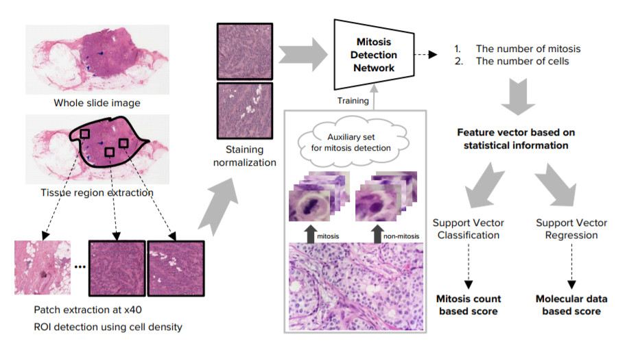
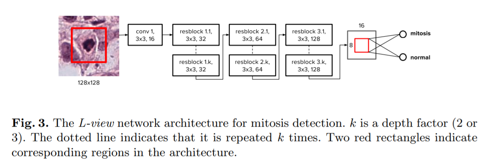

# A Unified Framework for Tumor Proliferation Score Prediction in Breast Histopathology

### 요약

**주의:** 모르는 내용이 간혹 reference로 있어서 정확히 이해하지 못한 부분이 존재함. 나중에 따로 공부 후 채워넣어야겠음.

#### 사전지식

* Tumor proliferation speed는 유방암을 진단하는 중요한 biomarker
* mitotic count는 Bloom & Richardson grading system의 일부인데, 유명한 진료 지표
  * 분열을 많이하면 mitosis가 많이 보여서 그런건가보다하고 넘어감
* Whole Slide Image(WSI) level에서 tumor proliferation을 측정해주었으면 좋겠는데, 지금까지는 ROI(Region of Interests)를 사람이 뽑아주면 그것으로 학습을 하였음
  * 이 부분을 자동화하는 것이 이 논문의 목적

#### 전체적인 방법

1. **(Whole Slide Image Handling > Tissue region and patch extraction && Region of Interests detection)** ROI를 골라낸다. 
2. **(Whole Slide Image Handling > Staining normalization)** 골라낸 ROI를 staining normalization(Tissue의 염색 정도를 표준화시키는 작업인 듯) 한다.
3. **(Deep Convolution Neural Networks based Mitosis Detection)** Mitosis Detection Network를 통해 # of mitosis와 # of cells를 구함
4. **(Tumor Proliferation Score Prediction)** 앞에서 구한 mitosis와 cells의 갯수와 추가적인 statistics information을 이용해 feature vector로 요약
5. **(Tumor Proliferation Score Prediction)** 앞에서 만든 feature vector를 데이터로 이용하여 SVM을 학습시켜 score를 낸다.

#### 각 단계별 포인트

##### Whole Slide Handling

* **Tissue region and patch extraction**
  * Bloom & Richardson grading이 연속되는 10개의 High Power Fields(HPFs) region에서의 mitosis의 수에 의존한다는 점을 통해 정사각형의 10 HPFs에 해당하는 patch를 뽑음
* **Region of interests detection**
  * Cell density가 높을수록 mitosis가 많이 나타나므로, 이를 이용하여 ROI를 뽑도록 한다.
  * 따라서 ROI는 HPF로 뽑은 것들 중에서 # of cells가 많은 순서대로 Sorting하여 K개를 고른다.
    ​

##### Deep Convolutional Neural Networks based Mitosis Detection

* **Training procedure**

  * 128x128 크기의 patch로 학습
  * 학습과정은 아래와 같음
     	1. 원래 가지고 있던 데이터셋(initial dataset)으로 학습시킨다.
     	2. Network가 inference한 것들 중 false positive로 분류된 것들을 추려낸다.
     	3. 앞에서 추려낸 data에 randon translation augmentation을 적용해 추가적은 데이터를 생성해 기존 데이터에 추가하여 새로운 데이터셋을 만든다.
     	4. 새로운 데이터셋을 이용하여 학습시킨다.

 *   **Architecture**

      *   mitosis detection network는 기본적으로 ResNet의 형태를 가지고 있다.

      *   9개의 Residual block을 가지고 있음. 아래의 사진 참고

          

     * 네트워크는 128x128 patch를 이용해 학습시킨 후, fully convolution network로 만든다.

     * 이러한 방식은 속도는 빠르지만 기존의 standart subdivision approach에 비해 performance가 좋지는 않은 문제가 있었다.

       * 이유는 정확히는 이해하지 못하겠으나 fully convolution technique을 사용할 때, training시점과 inference시점의  input size의 차이에서 오는 문제라는 듯

     * 이를 해결하기 위해 위의 사진과 같은 L-view를 만들었는데, L-view는 final global pooling layer에서 가운데의 64x64크기에 해당하는 부분만 activate시켜서 이 문제를 해결했다는 듯

     * **TODO:** ResNet과 fully convolution network를 공부해야겠음
       ​

##### Tumor Proliferation Score Prediction

마지막 모듈에서는 앞에서 mitosis detection network에서 구한 mitosis의 수과 cell의 수를 비롯해 21개의 추가적인 statistical information을 이용하여 feature vector를 만들고, 이를 SVM을 이용하여 score를 예측하도록 학습시켰다.

### 느낀점

* Architecture 부분에서 지식이 부족해서 완벽하게 이해하지 못했기 때문에, ResNet과 fully convolution network를 공부해봐야겠다고 생각함