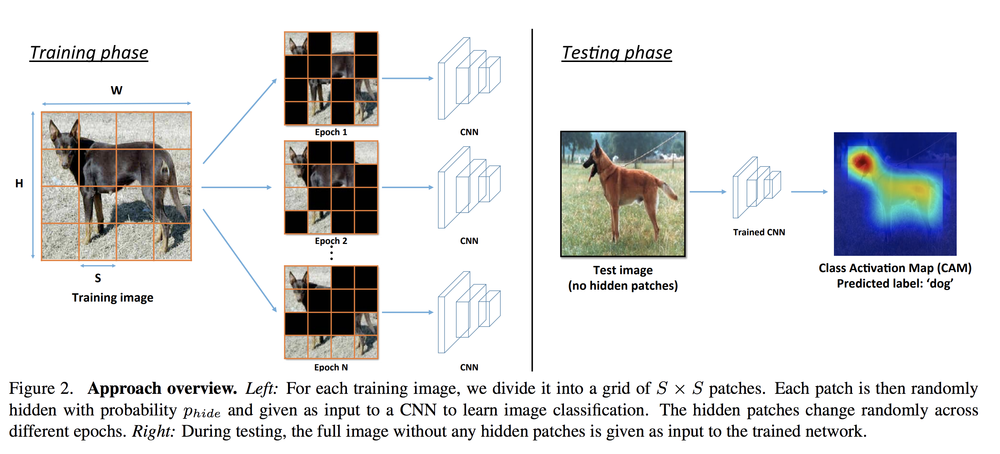
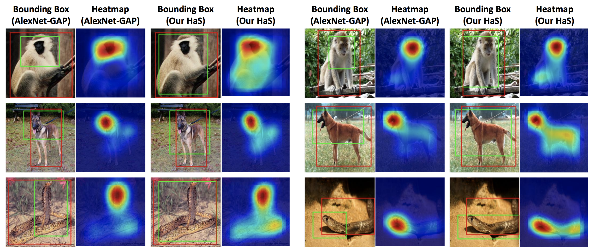

# [Hide-and-Seek: Forcing a Network to be Meticulous for Weakly-supervised Object and Action Localization](https://arxiv.org/abs/1704.04232)

다른 방법들에 많은 문제점들이 존재하지만, 간단하게 [Learning Deep Features for Discriminative Localization](https://arxiv.org/abs/1512.04150)의 문제점만 짚고 넘어가자면,
network가 highly-discriminative parts만으로도 classification이 가능했다면, less-discriminative parts는 찾지 않아버리는 문제가 있는 것이다. 물론 GAP layer를 사용하기 위해 architecture를 변경해야하는 것은 덤이다.

이 논문은 위와 같은 문제점을 데이터의 일부를 랜덤하게 가리는 Hide-and-Seek(HaS)라는 방법론을 이용해서 해결한다.
방법은 대략 아래와 같다.

### Main Idea

* Train시점에는 Input Image를 KxK의 patch들로 분할한 뒤, 일정 확률(여기서는 0.5를 주로 사용했다.)로 해당 grid를 숨긴다. 이렇게 하면 각 epoch마다 network는 highly discriminative한 일부 영역에만 의존할 수 없으므로, 다른 영역들도 관찰하게 된다.
* Test시점에는 전체 Input Image를 입력으로 넣어준다.
* 그러면, 네트워크가 Hide된 patch가 있던 것으로 학습할 때와 데이터의 입력 형태가 달라지므로, 학습시점에 network가 보던 것과는 다른 data distribution을 보게 되므로 성능이 떨어진다. 이를 해결하기 위해 hide된 patch영역은 모든 train data의 pixel들의 평균값으로 채운다. 이는 dropout에서 테스트 시점에 drop rate만큼 output을 나누는 것과 비슷한 원리다.

### 결과

### 개인적으로 흥미로웠던 포인트들
* 위와 같은 HaS를 input image뿐만 아니라, 중간의 conv layer에도 일정 크기의 patch의 모든 channel값을 숨기는 방식으로 했을 경우에도 효과가 있었다.
* CAM논문에서 까였던 GMP가 HaS와 만나니 성능이 GAP보다 좀 더 나아짐. 저자들은 GMP가 좀 더 noise에 robust해서라는데, 납득은 잘 안감.
* Input Layer에 dropout을 쓰면 잘 안됨. 저자들이 말하기는 drop시킨다고 해도, highly discriminative한 영역이 높은 확률로 보이기 때문이라고 한다. (예를 들어, RGB 값이 일정 영역에 전부 사라지는 경우는 적으니, 색이 좀 변하더라도 형태등은 보인다.)

### 아쉬운 점
* HaS에서 patch들이 hide될 확률을 높이면, classification 성능이 떨어져서 Localization 성능이 떨어지는 문제가 있다. 반면에 patch들의 hide될 확률을 낮추면, classification 성능은 높아지지만, 동시에 highly discriminative한 영역에만 의존하는 경향이 높아지므로 또 다시 Localization 성능이 떨어진다. 중간에 적정한 값을 찾아야한다.	