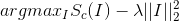
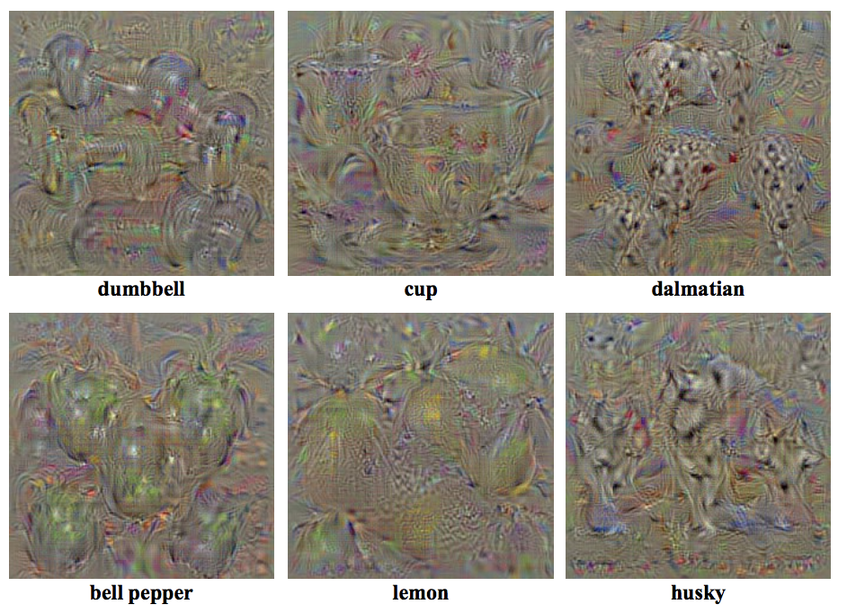
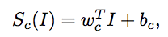
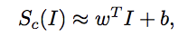
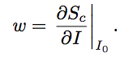
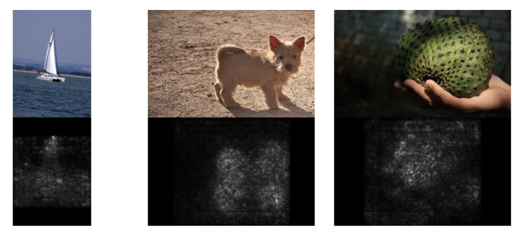
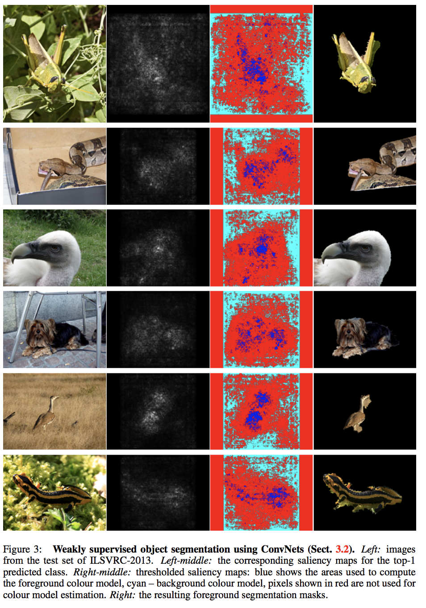

# [Deep Inside Convolutional Networks: Visualising Image Classification Models and Saliency Maps](https://arxiv.org/abs/1312.6034)

1. CNN을 학습시킨 후 class score S_c를 최대로 만드는 artifical image를 만들어 본다. (Class Model Visualization)
2. 특정 class에 대해, 주어진 Image의 각 pixel들이 class score를 형성하는데 얼마나 큰 중요도를 미쳤는지 시각화해본다.
3. 2.에서 만든 것을 GraphCut을 이용해 잘 잘라서 weakly supervised object localization을 해본다.

## 1. Class Model Visualization
주어진 클래스 c에 대해 다음의 식을 만족하는 Image I를 generate해보자.

 

이 이미지는 

1. 먼저 CNN을 학습시키고
2. weights를 fix한 뒤,
3. zero image(학습을 zero centered image로 했다면)를 back-propagation으로 gradient ascent를 통해 update해서 구한다.

참고, 왜 softmax를 통과한 score가 아닌 S_c를 학습시켰는가? 만일 softmax를 통과한 score로 학습을 시키면 관심있는 클래스의 score를 높이지 않고, 다른 클래스들의 score를 낮추는 방향으로 학습해 의미없어 보이는 사진이 만들어질 수 있기 때문.

아래는 결과 사진이다.

## 2. Image-Specific Saliency Visualization
주어진 이미지 I_0, 관심있는 클래스 c, score function S_c를 생각하자.

만약에 S_c가 그냥 linear model이라면, 식이 다음과 같을 것이다.

만일 저런 형태라면, w의 원소의 값이 곧 거기에 대응하는 pixel의 중요도가 된다. 이를 visualize해보는 것이 이 절의 목적이다.

CNN은 복잡한 함수이므로 Taylor급수로 아래와 같이 근사할 수 있다고 하고,

이때, w는 아래와 같다.

이 w는 달리 해석하자면, I_0의 어떤 픽셀값을 바꾸면 S_c가 가장 크게 변할 것인가이다.
아무튼 이 w는 I_0가 주어져있으면, Back-prop으로 구해서 잘 배치시키면 되며, 결과는 아래와 같다.

## 3. Weakly Supervised Object Localization
Image-Specific Saliency Visualization 부분에서 설명한 저 사진을 잘 자르면, localization을 할 수 있을 것 같지 않은가

그래서 GraphCut을 이용해 잘랐더니 아래와 같이 되었다고 한다.

