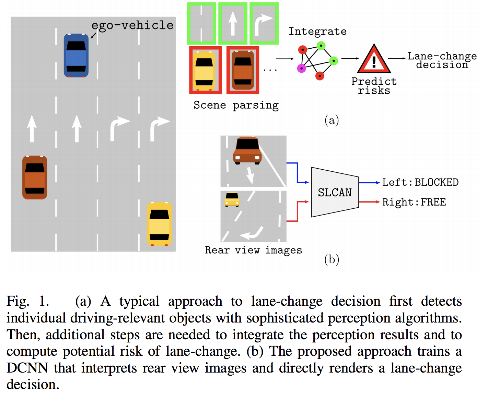
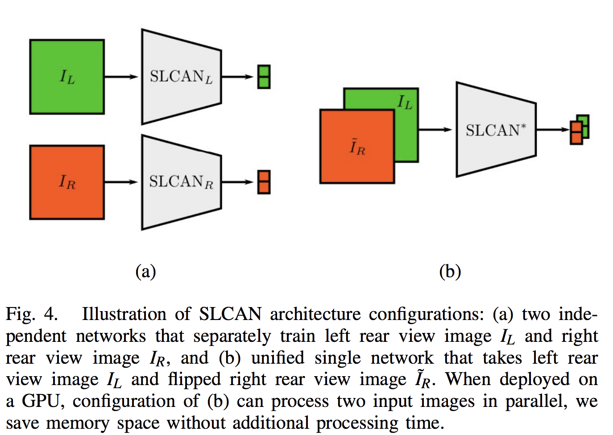
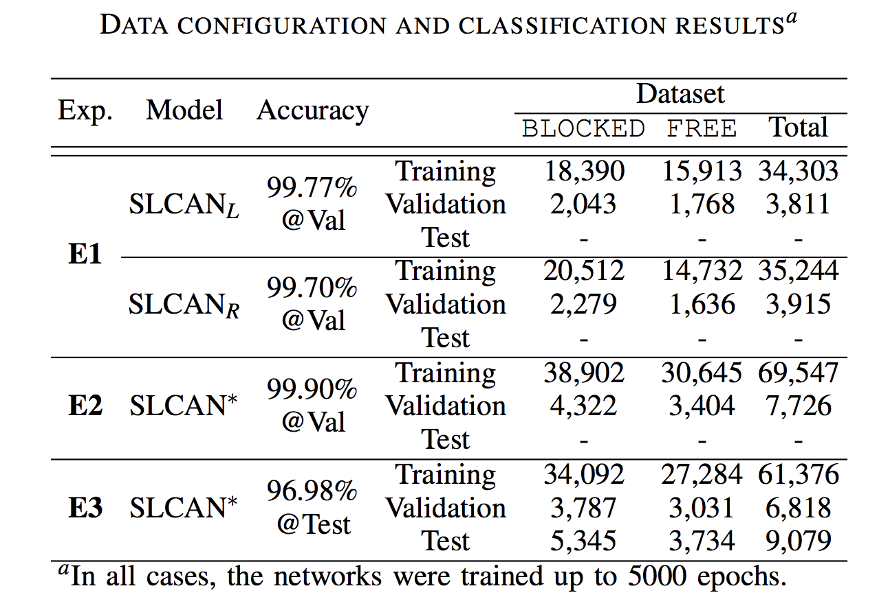

# [End-to-end Learning of Image based Lane-Change Decision](https://arxiv.org/abs/1706.08211)

## Abstract
저자들은 SLCAN(Safe Lane-Change Aid Network)라는 Lane change decision에 도움을 주는 네트워크를 제안한다.
이 네트워크는 rear view image를 입력으로 받아 차선변경이 안전한지 아닌지를 출력으로 내보낸다.

## Introduction
안전한 차선변경을 하기 위해 인간과 자율주행 자동차는 다음과 같은 행동을 한다.

1. *environmental perception*
2. *maneuver decision making*

*environmental perception*문제에 대해서는 SSD, R-FCN, Faster R-CNN 등등의 수많은 알고리즘이 등장했지만 실제 Lane-change 문제에서는 인지해야할 대상 객체들이 너무 많이 있기 때문에(나무, 울타리, 자동차, 사람 등) 실제로 적용하기에는 무리가 있었다.
한편, *maneuver decision making*은 *perception*의 결과를 통해 판단하는 경우가 많았다. 그렇게 때문에 인지한 결과를 취합하고 상황을 해석해야하는 복잡한 절차들이 필요했다. (아래 그림의 a)

이 논문에서 제안하는 아이디어의 핵심은 rear side image와 해당 사진의 옆 차선이 Blocked인지 Free인지를 이용한classification문제로 변형하여 풀면 위 사진의 b와 같이 중간과정 없이 end-to-end로 Lane-change decision을 내릴 수 있는 DCNN을 만들 수 있다는 것이다.

## SLCAN
실험은 간단하게 정리하자면 다음과 같은 과정을 거쳤다.

### Collected Data Annotation
일단 좌우 후방 카메라로 찍은 사진들에 Annotation을 붙였는데, 적어도 3명의 사람이 tagging을 하였으며, 다음과 같은 규칙으로 하였다고 한다.

1. 차가 옆 차선으로 이동할 수 없으면, BLOCKED (3명 이상의 사람이 만장일치로 BLOCKED라고 한 경우)
2. 차가 옆 차선으로 이동할 수 있으면, FREE (3명 이상의 사람이 만장일치로 FREE라고 한 경우)
3. 그 외의 판단하기 애매한 상황이라면 UNDEFINED

그리고 학습시에는 UNDEFINED의 경우는 제외하고 학습시켰다.

### Network Architecture
VGG16의 1000way final-classification layer를 2-way로 변경하고 fine-tune하였다.

### Experiments

실험은 다음과 같은 3가지 방식으로 하였다.

#### (**E1**) **Two independent networks for left and right rear view.** 
left and right rear view를 따로 받는 2개의 서로 다른 네트워크를 만들어 테스트(Fig. 4 (a))했는데, 이렇게 한 이유는 중앙선(한국에선 항상 운전자의 왼편에 있다.) 같은 요소들 때문에 양쪽이 서로 비대칭이기 떄문이다. 실험 결과의 표를 보면 알겠지만, 서로 데이터도 분리되어 있고 테스트도 분리된 데이터로만 하였다.

#### (**E2**) **Single network for both cameras**
Fig. 4 (b)에 묘사되어 있는 것처럼 하나의 네트워크를 이용해 학습을 시키기도 했는데, 방법은 right view를 좌우대칭으로 만들어서 하나의 네트워크에서 학습시킨 것이다. 이렇게 하므로써 2가지 이점을 누릴 수 있었는데, 먼저 더 많은 데이터 셋으로 학습할 수 있었을 것이며, 또 처리시간은 늘리지 않으면서 메모리를 절반 정도만 사용하면서 학습시킬 수 있다는 점이다. 이는 아무래도 2개의 네트워크를 GPU에 올리지 않고 하나만 올려도 되므로 모델이 차지하는 메모리가 절반으로 줄어든다는 뜻인 것 같다. 한편 처리시간이 그대로인 것은 잘 이해가 가지 않는데, 아무래도 2개의 네크워크를 parallel하게 학습시킨 것이 아니라 sequential하게 학습시키는 경우와 비교해서 인 것 같다.

#### (**E3**) **Single network for both cameras, trained on highway images and tested on urban road images**
간단히 말하자면, Train할 때 본 데이터와 다른 성격의 데이터로 Test를 해본 것이다.

추가적으로 Learning Rate은 0.001, batch size는 64로 학습시켰다고 한다.

## Future Work
연속적인 사진을 이용해 SLCAN을 학습시키는 것과 데이터셋을 좀 더 크고 정교하고 만드는 것 2가지를 말한 것으로 기억하는데 RNN-based SLCAN을 만들 것이라고 한다.

## 느낀점
운전을 해본 적이 없어서 그냥 객기일 수 있는데, 아마도 차선 변경할 때 더 중요한 것은 옆을 봤을 때 주위의 차가 어떻게 행동하고 있는가 인 것 같다. 예를 들어, 지금 옆이 비어있어도 옆 차선의 뒷편에서 누군가가 다른 차들과 비교했을 때, 훨씬 빠른 속도로 질주해 다가오고 있다면 차선 변경은 못 할 것 같다는 생각을 했는데, 역시 RNN-based SLCAN을 만든다고 하니...
