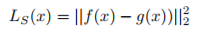
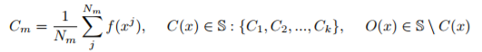
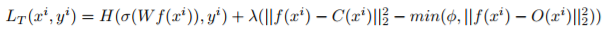

# Transferring Knowledge To Smaller Network With Class-Distance Loss

### 요약

#### Network의 크기가 작아야할 필요성

network의 capacity가 커지고 데이터가 충분하다면 network는 더 좋은 성능을 낸다. 하지만 inference의 속도를 높이고 메모리 사용을 줄이고 싶은 경우가 있을 수 있다. 예를 들어, 주로 API를 사용하지만 오프라인인 경우, 모바일에 설치된 neural network를 사용하도록 만들고 싶을 수 있다.

#### 관련 연구

Transferring을 하는 방법에는 크게 다음의 2가지 방법이 있다.

* mimic learning
  * pretrained된 teacher network를 따라하도록 학습시키는 방법
  * ex) ensemble된 network들을 single network로 옮긴 연구
  * ex) logits의 값을 matching하도록 학습시킨 경우 등
* model compression
  * 직접 모델의 사이즈(parameter의 수나 computation)를 줄이는 방식
  * ex) pruning, Huffman coding 등을 이용한 경우 등

#### 이 논문의 방식

Teacher Network(T), Student Network(S)를 각각 f, g라고 하자. (잊을까봐 써두는데 CNN에서 fully connected layer를 통과해 softmax를 들어가기 전까지를 말함. 예를 들면 relu6. 즉, 여기서는 feature vector를 S와 T가 똑같게 만들도록 학습시키고 fully connected 이후는 같은 Weight를 사용)

그러면 Student를 학습시킬 때는 아래의 식을 사용한다.

즉, pretrained된 T의 feature를 흉내내도록 S를 학습.

하지만 T를 평소대로 cross entropy로만 학습시켰을 경우, S의 성능이 낮았음. (경험적으로 그렇다고 함. 개선된 objective를 보면 왜 성능이 낮았는지 예상해볼 수 있음)

그래서 T를 학습하는 방법도 바꿀 필요가 있었음. 먼저 아래의 식을 정의하자.

위에서 Cm은 Class m의 feature vector들의 평균값이다. C(x)와 O(x)는 x를 Cm과 Cn(m != n)으로 mapping하는 함수이다.

이제 T의 개선된 Objective를 보자.

* 여기서 첫번째 Term은 typical한 cross entropy term이다. 
  * 즉 feature vector를 fully connected에 통과시킨후 softmax를 통과시킨 결과
  * 이 Term은 평소대로 T가 class를 잘 맞추도록 유도한다.
* 두번째 Term이 실질적으로 새로 추가되었다고 보면 된다.
  * 람다는 weighting parameter이다.
  * 두번째 Term의 첫번째 부분은 feature vector가 intra class의 mean에 접근하도록 유도한다. 즉 intra-class에서 feature vector들이 mean주변에 위치하게 만듦으로써 서로 dense해지도록 유도한다.
  * 뒤의 minus가 붙은 Term은 inter class끼리 서로 멀어질 수록 loss가 줄어들도록 유도한다. 즉, 서로 다른 클래스끼리는 feature vector들의 값이 멀리 떨어지도록 유도한다. 동시에 파이로 인해 너무 거리가 발산하진 않도록 한다.

저렇게 하면 클래스끼리 feature vector가 더 dense하게 모이면서 흉내를 잘 낼 수 있는 여건이 된다.

#### 한계

실험 결과 클래스의 갯수가 작은 경우에만 잘 작동하였다.

### 느낀점

* Transfer Learning은 그저 Fine-tuning이라고 생각했는데, 이것 또한 나름의 분류가 있다는 점을 새로 배우게 됨
* Lunit의 논문들을 차례로 읽어볼까 생각이 들었음